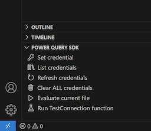

# aps-props-connector

[Custom Power BI data connector](https://learn.microsoft.com/en-us/power-bi/connect-data/desktop-connector-extensibility), used to load design properties from [Autodesk Platform Services](https://aps.autodesk.com).

## Development

### Prerequisites

- [APS app credentials](https://forge.autodesk.com/en/docs/oauth/v2/tutorials/create-app)
- [Power Query SDK](https://learn.microsoft.com/en-us/power-query/install-sdk)
- [.NET 7](https://dotnet.microsoft.com/en-us/download/dotnet/7.0) (in case you want to build the connector manually)

### Running locally

- Clone this repository
- Create a _secrets.json_ file in the project folder, and populate it with your APS application client ID and secret:

```json
{
    "APS_CLIENT_ID": "<your client id>",
    "APS_CLIENT_SECRET": "<your client secret>"
}
```

- Open the project folder in Visual Studio or Visual Studio Code with the _Power Query SDK_ installed
- Use the _Power Query SDK_ to create new credentials, for example, by clicking the _Set credential_ option in Visual Studio Code



- Open the [DesignPropsConnector.query.pq](./DesignPropsConnector.query.pq) file, and add your own design URN (see the _FAQ_ section below for more details about _URN_ values) and region ("US" or "EMEA")
- Run the data connector using  _Power Query SDK_, for example, by clicking the _Evaluate current file_ option in Visual Studio Code

### Publishing

- Build the project using `dotnet build`
- Import the generated *.mez file from the _bin_ subfolder into Power BI Desktop application as explained [here](https://learn.microsoft.com/en-us/power-bi/connect-data/desktop-connector-extensibility#custom-connectors)
- In Power BI Desktop, the custom connector will be available under the name _APS Design Properties Connector_

## FAQ

### Where do I find the URN?

You can retrieve the design URN after loading the design into any APS-based application. For example, after opening the design of your choice in [Autodesk Construction Cloud](https://construction.autodesk.com), open the browser console and type `NOP_VIEWER.model.getData().urn` to retrieve the URN.

## Troubleshooting

Please contact us via https://aps.autodesk.com/get-help.

## License

This sample is licensed under the terms of the [MIT License](http://opensource.org/licenses/MIT). Please see the [LICENSE](LICENSE) file for more details.
